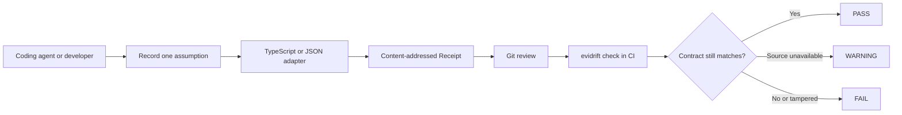

# Evidrift — API drift checks for AI-generated TypeScript and OpenAPI code

[English](README.md) | [繁體中文](README.zh-TW.md)

[](https://github.com/bm1016bm-svg/evidrift/actions/workflows/ci.yml)
[](https://www.npmjs.com/package/evidrift)
[](https://bm1016bm-svg.github.io/evidrift/)
[](https://www.tensorblock.co/mcp/servers/github-bm1016bm-svg-evidrift-85713ef9)

> **Code compiles. APIs drift. Evidrift is the lockfile for AI assumptions.**

Coding agents can write against a TypeScript dependency or OpenAPI contract that changes tomorrow. Evidrift records the exact call signature or repository JSON value as a content-addressed Receipt, then makes CI recompute it before merge.

Local-first CLI. STDIO MCP server. No account, no cloud backend, no LLM judge, and no package code execution.

It deterministically catches selected TypeScript overload and parameter drift, repository-local OpenAPI or JSON Schema value drift through RFC 6901 JSON Pointer, and hand-edited or forged Receipt content.


[](#quick-start--see-drift-in-one-command)

The animation is rendered from a [captured CLI transcript](https://github.com/bm1016bm-svg/evidrift/blob/main/docs/assets/evidrift-demo-transcript.txt). The PASS, changed signatures, affected file, and deterministic FAIL come from an actual local `evidrift demo` run; only the scene headings are editorial.

## Quick Start — See Drift in One Command

Requires Node.js 22 or newer. Nothing to install globally:

```bash
npx --yes evidrift@latest demo
```

The command creates a disposable local fixture, records the optional `options` parameter on `parseConfig`, checks it successfully, changes the fixture so `options` is required, then proves that `evidrift check` catches the mismatch. It runs no downloaded package code.

**If that is a failure you want caught before merge, [star Evidrift on GitHub](https://github.com/bm1016bm-svg/evidrift).**

## Supported Today

| Surface                          | Deterministic evidence                                                  | Status             |
| -------------------------------- | ----------------------------------------------------------------------- | ------------------ |
| Installed TypeScript dependency  | Selected call signature, parameter, package version, and declaration    | Supported          |
| Repository OpenAPI / JSON Schema | Canonical value selected through an RFC 6901 JSON Pointer               | Supported for JSON |
| CLI and local STDIO MCP          | The same record and revalidation core                                   | Supported          |
| YAML, URLs, remote `$ref`        | None; Evidrift refuses these inputs instead of making an unsafe promise | Not supported      |

## Installation — Add It to a Repository

Initialize the current repository without a global install, account, API key, or cloud backend:

```bash
npx --yes evidrift@latest init
```

To pin Evidrift for a team or CI workflow:

```bash
npm install --save-dev evidrift
npx evidrift init
```

That is the product: make an AI assumption reviewable now, then make CI check the same contract later.

## Use It in a Repository

The dependency must already be installed inside the target repository, and the affected code path must name a real file.

```bash
cd /path/to/your/repository
evidrift init

evidrift record \
  --project . \
  --package your-package \
  --symbol exportedFunction \
  --parameter options \
  --claim "exportedFunction accepts the options used here." \
  --code src/caller.ts:12

evidrift check
```

When `--code` includes a line containing an overloaded call, Evidrift asks TypeScript which overload that call actually resolves to. `--overload <number>` remains an explicit fallback for incomplete or non-compiling call sites.

Lock one value from a repository-local OpenAPI or JSON Schema document:

```bash
evidrift record \
  --json openapi.json \
  --pointer /paths/~1users/get/operationId \
  --claim "The generated client calls listUsers." \
  --code src/client.ts:24
```

JSON Pointer follows RFC 6901, including `~1` for `/` and `~0` for `~`. Evidrift reads `.json` files only; it never fetches URLs or resolves remote references.

Coding agents call the same core through `evidrift_record` and `evidrift_record_json_pointer`. Minimal [Codex, Claude Code, and Cursor setup](docs/mcp.md) is included.

## How It Works



The CLI and MCP server are thin entry points over the same core. The complete component map, check policy, resource bounds, and trust boundary are documented in [Architecture](docs/architecture.md).

## The Files

Evidrift writes one lock and one immutable JSON file per Receipt:

```text
.evidrift/
  evidence.lock
  receipts/
    <64-character-sha256>.json
```

There is no `.evidrift/receipts.json`. `evidence.lock` contains only content-addressed Receipt IDs:

```json
{
  "receipts": ["sha256:9bfbb065cff372abe52e8e269123959e9f2ae84cd02230dc751f768ac5e4c274"],
  "schemaVersion": 1
}
```

Each Receipt stores the claim and affected code plus one deterministic contract: an installed TypeScript symbol signature, or a repository JSON path, pointer, canonical value, and hashes. See the [Receipt schema](docs/receipt-schema.md).

## Add It to CI

Pin Evidrift as a development dependency and expose one stable package script:

```json
{
  "scripts": {
    "evidrift:check": "evidrift check"
  }
}
```

After `npm ci`, make that script a required CI step:

```yaml
- name: Revalidate Evidrift receipts
  run: npm run evidrift:check
```

The complete [GitHub Actions setup](docs/ci.md) uses read-only permissions, locked npm dependencies, and commit-pinned Actions.

## CI Behavior

`evidrift check` does not trust saved `matched` or `verified` flags. It validates the Receipt, reloads the source, and recomputes the selected signature or JSON value.

| Result                    | Meaning                                                            | Exit |
| ------------------------- | ------------------------------------------------------------------ | ---: |
| `PASS`                    | The deterministic signature or JSON value still matches            |    0 |
| `WARNING source_changed`  | Source identity/content changed, but the selected contract matches |    0 |
| `WARNING unverifiable`    | Source is missing, invalid, or cannot be inspected                 |    0 |
| `FAIL contract_mismatch`  | Selected TypeScript signature or JSON value changed/disappeared    |    1 |
| `FAIL evidence_integrity` | Lock or Receipt is malformed, missing, forged, or hash-invalid     |    2 |

A one-line manual edit to a Receipt produces an actionable integrity report:

```text
FAIL evidence_integrity sha256:...
Message: Receipt content hash mismatch.
Receipt ID: sha256:...
Action: Do not trust or hand-edit this Receipt. Restore it from version control, or intentionally create a new Receipt with `evidrift record`.
```

The project workflow runs the full gate on Linux and Windows with Node.js 22 and 24. Third-party Actions are pinned to full commit SHAs.

In a human TTY, `check`, `diff`, `explain`, and `demo` use a spinner plus green `✅`, yellow `⚠`, and red `❌` status output. Redirected output, CI, `TERM=dumb`, and `NO_COLOR` stay ANSI-free and keep the stable plain-text format used by agents and tests.

## Why This Is Not RAG, Sonar, or AI Review

| Tool                  | Its job                                        | Evidrift's job                                         |
| --------------------- | ---------------------------------------------- | ------------------------------------------------------ |
| RAG                   | Fetch context while an answer is being written | Commit one assumption and check it again later         |
| Sonar/static analysis | Find code patterns and quality problems        | Revalidate an explicit external dependency contract    |
| AI code review        | Make a probabilistic judgment                  | Produce a deterministic result without an LLM CI judge |

Use all of them if they help. Evidrift covers one gap: the reason code was written can go stale even when the code itself did not change.

## Frequently Asked Questions

### What is API drift?

API drift is a change to a dependency or contract after code was written against it. Evidrift v0.3.3 checks two deterministic forms: the TypeScript call signature selected at an affected code location, and a canonical value selected from repository-local OpenAPI JSON or JSON Schema.

### Is Evidrift a contract-testing tool?

It is narrower than end-to-end contract testing. Contract tests exercise provider and consumer behavior; Evidrift locks one explicit assumption that influenced code and revalidates that assumption in CI without running dependency code.

### Does Evidrift work with Codex, Claude Code, and Cursor?

Yes. They can call the local STDIO MCP server to create Receipts through the shared verification core. The agent cannot directly mark a Receipt as verified. See the [minimal MCP configurations](docs/mcp.md).

### Does Evidrift fetch OpenAPI URLs or execute package code?

No. The v0.3.3 adapters inspect installed TypeScript declarations and repository-local `.json` files. They do not fetch URLs, resolve remote `$ref`, import dependency JavaScript, or execute arbitrary commands.

### Does Evidrift prove that AI-generated code is correct?

No. It detects deterministic evidence drift and Receipt tampering. It does not prove runtime correctness, validate free-text semantics, or eliminate hallucinations. See [What Evidrift Does Not Prove](#what-evidrift-does-not-prove).

## CLI

```text
evidrift init
evidrift record --project <path> --package <name> --symbol <name> \
  [--parameter <name>] [--overload <number>] --claim <text> --code <path[:line]>
evidrift record --json <path> --pointer <RFC6901> --claim <text> --code <path[:line]>
evidrift check
evidrift diff
evidrift explain <receipt-id>
evidrift demo
evidrift mcp
```

All commands accept `--root <repo>`. `record` requires an initialized `.evidrift/evidence.lock`.

`evidrift mcp` starts the same local STDIO server exposed by the `evidrift-mcp` bin. It exists so package registries and MCP clients can launch Evidrift deterministically from the main npm package.

## Trust Boundary

`.evidrift/receipts/*.json` is untrusted input. Every check:

1. Strictly validates lock and Receipt schemas.
2. Derives file paths only from full SHA-256 IDs.
3. Recomputes the expected contract hash and Receipt content hash.
4. Resolves declarations or repository-local JSON without importing package JavaScript, running shell commands, making network requests, or calling an LLM.
5. Reports evidence integrity, source drift, semantic support, and runtime correctness separately.

The parser refuses more than 1,024 Receipt IDs or 64 call signatures per symbol. TypeScript evidence is confined to repository files and capped at 256 source files, 2 MiB per file, and 16 MiB total. JSON sources are capped at 4 MiB and selected canonical values at 1 MiB. Dynamic text is rejected or escaped so a Receipt cannot inject terminal controls or fake CI lines.

Content hashes detect inconsistent edits; they do not prove authorship. Someone who rewrites a Receipt, recalculates its ID, and changes `evidence.lock` can create new internally valid evidence. Git review and branch protection must catch that replacement. See [Architecture](docs/architecture.md).

## What Evidrift Does Not Prove

Evidrift does not prove code is correct. It does not prove a free-text claim is true, inspect runtime behavior, eliminate hallucinations, scan dependency vulnerabilities, or validate arbitrary URLs.

The v0.3 source tree resolves overloaded TypeScript calls from the affected `path:line` when the consumer code compiles and TypeScript can identify one declared overload. Invalid, ambiguous, or missing calls are refused rather than guessed; `--overload` is the explicit fallback. The Receipt stores the selected normalized signature and hash, so declaration reordering does not cause false drift.

The `json.pointer` adapter locks canonical values in repository-local `.json` files. It does not support YAML, URLs, remote `$ref`, schema validation, or semantic equivalence. It follows repository-local TypeScript declaration imports, but does not expand every named type into a deep structural contract. Missing or unreadable source is a visible but non-blocking warning. These are deliberate limits, not hidden guarantees.

The runnable [boss-fight test](examples/boss-fight-test/README.md) resolves one of three overloads from a real call using a complex cross-file type alias, survives declaration reordering, and deterministically fails when only the selected overload changes.

## Development and UAT

```bash
npm run format:check
npm run lint
npm run typecheck
npm test
npm run uat
npm run check
```

`npm run verify` runs the release gate. Tests use temporary local fixtures and require no secrets, paid APIs, Evidrift backend, or network access. The detailed [UAT report](docs/UAT.md) maps each acceptance case to an automated test and states the remaining risks.

## License

[Mozilla Public License 2.0](LICENSE).
