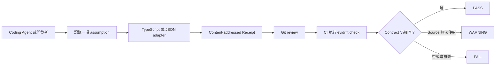

# Evidrift — 檢查 AI 產生的 TypeScript 與 OpenAPI 程式碼是否發生 API drift

[English](README.md) | [繁體中文](README.zh-TW.md)

[](https://github.com/bm1016bm-svg/evidrift/actions/workflows/ci.yml)
[](https://www.npmjs.com/package/evidrift)
[](https://bm1016bm-svg.github.io/evidrift/zh-TW/)

> **Code compiles. APIs drift. Evidrift 是 AI assumptions 的 lockfile。**

Coding Agent 可能依照今天的 TypeScript dependency 或 OpenAPI contract 寫出程式，但外部 contract 明天就變了。Evidrift 會把實際使用的 call signature 或 repository-local JSON value 記錄成 content-addressed Receipt，再讓 CI 在合併前重新計算。

Local-first CLI、STDIO MCP Server。不需要帳號、雲端後端或 LLM judge，也不會執行 dependency package code。

Evidrift 能確定性偵測指定的 TypeScript overload／parameter drift、透過 RFC 6901 JSON Pointer 選取的 OpenAPI 或 JSON Schema value drift，以及遭到手動修改或偽造的 Receipt。


[](#快速開始--用一個指令看到-drift)

這段動畫由[實際擷取的 CLI transcript](https://github.com/bm1016bm-svg/evidrift/blob/main/docs/assets/evidrift-demo-transcript.txt)產生。`PASS`、改變前後的 signature、affected file 與 deterministic `FAIL` 都來自本機執行的 `evidrift demo`；只有場景標題是後製文字。

## 快速開始 — 用一個指令看到 drift

需要 Node.js 22 或更新版本。不必全域安裝：

```bash
npx --yes evidrift@latest demo
```

這個指令會建立可丟棄的本機 fixture、記錄 `parseConfig` 的 optional `options` parameter、完成第一次檢查，接著把 fixture 改成 required `options`，最後證明 `evidrift check` 能抓到 mismatch。過程不會執行下載套件的 JavaScript code。

**如果你也想在 merge 前攔下這類錯誤，可以在 [GitHub 上替 Evidrift 加星](https://github.com/bm1016bm-svg/evidrift)。**

完整推演請看：[TypeScript 編譯通過，但 dependency signature 已漂移](https://bm1016bm-svg.github.io/evidrift/zh-TW/cases/typescript-signature-drift.html)。

## 目前支援範圍

| Surface                          | Deterministic evidence                                             | 狀態      |
| -------------------------------- | ------------------------------------------------------------------ | --------- |
| 已安裝的 TypeScript dependency   | Selected call signature、parameter、package version 與 declaration | 支援      |
| Repository OpenAPI / JSON Schema | 透過 RFC 6901 JSON Pointer 選取的 canonical value                  | 支援 JSON |
| CLI 與 local STDIO MCP           | 共用相同的 record 與 revalidation core                             | 支援      |
| YAML、URL、remote `$ref`         | 無；Evidrift 會拒絕輸入，不會做出不安全的保證                      | 不支援    |

## 安裝 — 加入現有 Repository

不需要全域安裝、Evidrift 帳號、API key 或雲端後端：

```bash
npx --yes evidrift@latest init
```

如果要為團隊或 CI 固定版本：

```bash
npm install --save-dev evidrift
npx evidrift init
```

產品的核心就是：現在把 AI assumption 變成可 review 的 repository evidence，之後讓 CI 重新檢查同一個 deterministic contract。

## 在 Repository 中使用

目標 dependency 必須已經安裝在 repository 裡，`--code` 也必須指向真實檔案。

```bash
cd /path/to/your/repository
evidrift init

evidrift record \
  --project . \
  --package your-package \
  --symbol exportedFunction \
  --parameter options \
  --claim "exportedFunction accepts the options used here." \
  --code src/caller.ts:12

evidrift check
```

當 `--code` 的指定行包含 overloaded call，Evidrift 會詢問消費端專案的 TypeScript compiler：這個 call 實際解析到哪一條 overload。若 call site 不完整或無法編譯，仍可明確使用 `--overload <number>`，Evidrift 不會自行猜測。

記錄 repository-local OpenAPI JSON 或 JSON Schema 中的一個 value：

```bash
evidrift record \
  --json openapi.json \
  --pointer /paths/~1users/get/operationId \
  --claim "The generated client calls listUsers." \
  --code src/client.ts:24
```

JSON Pointer 遵循 RFC 6901，其中 `~1` 代表 `/`、`~0` 代表 `~`。Evidrift 只讀取 repository-local `.json`，不會抓取 URL 或解析 remote `$ref`。

Coding Agent 透過 `evidrift_record` 與 `evidrift_record_json_pointer` 呼叫相同核心。Repository 包含 [Codex、Claude Code 與 Cursor 的最小 MCP 設定](docs/mcp.md)。

## 運作方式



CLI 與 MCP Server 都是相同 core 的入口。完整 component map、check policy、resource bound 與 trust boundary 請參考英文版 [Architecture](docs/architecture.md)。

## 產生的檔案

Evidrift 會寫入一份 lock，以及每張 Receipt 對應的一個 immutable JSON file：

```text
.evidrift/
  evidence.lock
  receipts/
    <64-character-sha256>.json
```

不存在 `.evidrift/receipts.json`。`evidence.lock` 只儲存 content-addressed Receipt ID：

```json
{
  "receipts": ["sha256:9bfbb065cff372abe52e8e269123959e9f2ae84cd02230dc751f768ac5e4c274"],
  "schemaVersion": 1
}
```

每張 Receipt 會保存 claim、affected code，以及一項 deterministic contract：已安裝 TypeScript symbol signature，或 repository JSON path、pointer、canonical value 與 hashes。請參考英文版 [Receipt schema](docs/receipt-schema.md)。

## 加入 CI

把 Evidrift 固定為 development dependency，並提供穩定的 package script：

```json
{
  "scripts": {
    "evidrift:check": "evidrift check"
  }
}
```

在 `npm ci` 後把它設為必要 CI step：

```yaml
- name: Revalidate Evidrift receipts
  run: npm run evidrift:check
```

完整 [GitHub Actions 設定](docs/ci.md)使用 read-only permission、鎖定的 npm dependency 與固定到 commit 的 Actions。

## CI 行為

`evidrift check` 不信任儲存的 `matched` 或 `verified` flag。它會驗證 Receipt、重新載入來源，再計算 selected signature 或 JSON value。

| Result                    | 意義                                                          | Exit |
| ------------------------- | ------------------------------------------------------------- | ---: |
| `PASS`                    | Deterministic signature 或 JSON value 仍相同                  |    0 |
| `WARNING source_changed`  | Source identity/content 改變，但 selected contract 仍相同     |    0 |
| `WARNING unverifiable`    | Source 遺失、無效或無法安全檢查                               |    0 |
| `FAIL contract_mismatch`  | Selected TypeScript signature 或 JSON value 改變／消失        |    1 |
| `FAIL evidence_integrity` | Lock 或 Receipt malformed、遺失、偽造，或 content hash 不正確 |    2 |

如果直接手改 Receipt，輸出會是可處置的 integrity report，而不是混亂的 stack trace：

```text
FAIL evidence_integrity sha256:...
Message: Receipt content hash mismatch.
Receipt ID: sha256:...
Action: Do not trust or hand-edit this Receipt. Restore it from version control, or intentionally create a new Receipt with `evidrift record`.
```

專案的 GitHub Actions workflow 會在 Linux 與 Windows 使用 Node.js 22、24 執行完整 gate。第三方 Actions 全部固定到完整 commit SHA。

在人類操作的 TTY 中，`check`、`diff`、`explain` 與 `demo` 會顯示 spinner 和綠色 `✅`、黃色 `⚠`、紅色 `❌` 狀態。Redirected output、CI、`TERM=dumb` 與 `NO_COLOR` 會維持無 ANSI 的穩定純文字格式，方便 Coding Agent 與測試解析。

## 它不是 RAG、Sonar 或 AI Code Review

| Tool                  | 它的工作                             | Evidrift 的工作                                |
| --------------------- | ------------------------------------ | ---------------------------------------------- |
| RAG                   | 在產生答案時取得 context             | Commit 一項 assumption，稍後再檢查             |
| Sonar/static analysis | 找出 code pattern 與 quality problem | 重新驗證明確的 external dependency contract    |
| AI code review        | 做 probabilistic judgment            | 不使用 LLM CI judge，產生 deterministic result |

這些工具可以一起用。Evidrift 補的是另一個缺口：程式碼本身沒有改變，不代表當初寫下那段程式的外部理由仍然成立。

## 常見問題

### 什麼是 API drift？

API drift 是 dependency 或 contract 在消費端程式寫完後發生改變。Evidrift v0.3.3 檢查兩種 deterministic evidence：affected code location 實際選到的 TypeScript call signature，以及 repository-local OpenAPI JSON 或 JSON Schema 中選定的 canonical value。

### Evidrift 是 contract-testing tool 嗎？

範圍比 end-to-end contract testing 更窄。Contract tests 會執行 provider／consumer behavior；Evidrift 不執行 dependency code，而是鎖定影響某個 code location 的一項明確 static assumption，再於 CI 重新驗證。

### Evidrift 能與 Codex、Claude Code、Cursor 搭配嗎？

可以。它們能呼叫 local STDIO MCP Server，透過與 CLI 共用的 verification core 建立 Receipt。Agent 不能自行把 Receipt 標成 verified。請參考[最小 MCP 設定](docs/mcp.md)。

### Evidrift 會抓 OpenAPI URL 或執行 package code 嗎？

不會。v0.3.3 adapters 只檢查已安裝的 TypeScript declaration 與 repository-local `.json` file；不會抓 URL、解析 remote `$ref`、import dependency JavaScript 或執行 arbitrary command。

### Evidrift 能證明 AI 產生的程式碼正確嗎？

不能。它檢查 deterministic evidence drift 與 Receipt tampering；不證明 runtime correctness、不驗證 free-text semantics，也不消除 hallucination。請參考[不能保證的事](#evidrift-不能保證什麼)。

更多回答請看[繁中 FAQ](https://bm1016bm-svg.github.io/evidrift/zh-TW/faq.html)。

## CLI

```text
evidrift init
evidrift record --project <path> --package <name> --symbol <name> \
  [--parameter <name>] [--overload <number>] --claim <text> --code <path[:line]>
evidrift record --json <path> --pointer <RFC6901> --claim <text> --code <path[:line]>
evidrift check
evidrift diff
evidrift explain <receipt-id>
evidrift demo
evidrift mcp
```

所有指令都接受 `--root <repo>`。`record` 要求 repository 中已有初始化完成的 `.evidrift/evidence.lock`。

`evidrift mcp` 會啟動 `evidrift-mcp` bin 所提供的同一個 local STDIO server，讓 package registry 與 MCP client 能從主要 npm package 確定性啟動 Evidrift。

## Trust Boundary

`.evidrift/receipts/*.json` 是不可信任輸入。每次檢查都會：

1. 嚴格驗證 lock 與 Receipt schema。
2. 只從完整 SHA-256 ID 推導 file path。
3. 重新計算 expected contract hash 與 Receipt content hash。
4. 解析 declaration 或 repository-local JSON；不 import package JavaScript、不執行 shell command、不發 network request，也不呼叫 LLM。
5. 分開回報 evidence integrity、source drift、semantic support 與 runtime correctness。

Parser 最多接受 1,024 個 Receipt ID，以及每個 symbol 64 個 call signature。TypeScript evidence 只能位於 repository 內，最多讀取 256 個 source file、每檔 2 MiB、總計 16 MiB。JSON source 上限為 4 MiB，selected canonical value 上限為 1 MiB。Dynamic text 會被拒絕或 escape，避免 Receipt 注入 terminal control character 或偽造 CI output。

Content hash 能偵測不一致修改，但不證明作者身分。若有人重寫 Receipt、重新計算 ID 並更新 `evidence.lock`，仍可產生新的 internally valid evidence；Git review 與 branch protection 必須攔下這種 replacement。請參考英文版 [Architecture](docs/architecture.md)。

## Evidrift 不能保證什麼

Evidrift 不證明程式碼正確、不證明 free-text claim 為真、不檢查 runtime behavior、不消除 hallucination、不掃描 dependency vulnerability，也不驗證 arbitrary URL。

v0.3 source tree 能在 consumer code 可編譯、TypeScript 能辨識唯一 declared overload 時，從 affected `path:line` 解析 overloaded call。Invalid、ambiguous 或 missing call 會被拒絕，不會猜測；`--overload` 是明確 fallback。Receipt 儲存 selected normalized signature 與 hash，所以 declaration reordering 不會造成 false drift。

`json.pointer` adapter 只鎖定 repository-local `.json` 的 canonical value，不支援 YAML、URL、remote `$ref`、schema validation 或 semantic equivalence。它會追蹤 repository-local TypeScript declaration import，但不會把所有 named type 展開成 deep structural contract。Missing 或 unreadable source 會產生可見但 non-blocking warning。這些是明確限制，不是隱藏保證。

可執行的 [boss-fight test](examples/boss-fight-test/README.md) 會從三條 overload 中，依照使用複雜 cross-file type alias 的真實 call 選出一條；declaration reordering 仍會通過，只有 selected overload 改變時才 deterministic FAIL。

## 開發與 UAT

```bash
npm run format:check
npm run lint
npm run typecheck
npm test
npm run uat
npm run check
```

`npm run verify` 是 release gate。測試只使用 temporary local fixture，不需要 secret、付費 API、Evidrift backend 或 network access。詳細的 [UAT report](docs/UAT.md) 會把每個 acceptance case 對應到 automated test，並列出仍然存在的風險。

## 翻譯與機器介面

繁中版翻譯說明文字，但 CLI command、Receipt schema field、error code、API name 與 machine-readable output 刻意維持英文。這能避免 CI、MCP client、Coding Agent 與兩種語言的文件產生不一致。

## License

[Mozilla Public License 2.0](LICENSE)。
