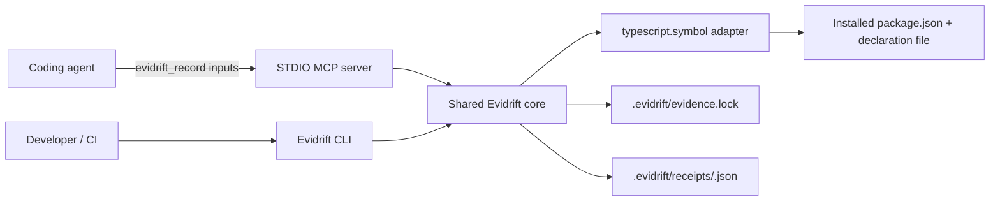

# Architecture

Evidrift v0.2 is a local TypeScript application with one deterministic adapter. The CLI and MCP server are thin entry points over the same core.

## Components

- `src/cli.ts`: argument parsing, output, and exit codes for `init`, `record`, `check`, `diff`, `explain`, and `demo`.
- `src/mcp.ts`: one STDIO tool, `evidrift_record`; it accepts locators, not raw receipts.
- `src/core.ts`: record and revalidation policy shared by CLI and MCP.
- `src/demo.ts`: a self-contained local fixture that deliberately changes one dependency signature.
- `src/output.ts` and `src/terminal.ts`: TTY-only presentation and stable machine-readable fallback output.
- `src/adapter/typescript-symbol.ts`: dependency resolution and TypeScript Compiler API inspection.
- `src/storage.ts`: strict untrusted-input validation, canonical writes, content hashes, and lock handling.
- `src/canonical.ts`: deterministic serialization and SHA-256.

## Record path

1. Require an existing target repository and `.evidrift/evidence.lock`.
2. Constrain project and affected-code paths to the repository; affected code must resolve to a regular file.
3. Resolve a registry-style npm dependency from the consuming `package.json`.
4. Locate the package's `types`/`typings` entry without importing or executing package code.
5. Require the package and declaration file to resolve inside the repository.
6. Use the TypeScript Compiler API to locate one exported callable symbol and its parameter.
7. If the symbol is overloaded, require an explicit 1-based selector and choose that call signature. The index is not persisted.
8. Normalize the selected signature, hash it, construct the Receipt payload, and derive the Receipt ID from canonical JSON.
9. Write the Receipt and add its ID to `evidence.lock`.

## Check path and policy

Every check treats both the lock and receipt files as attacker-controlled.

| Axis                | Recomputed signal                                                  | v0.2 policy                                    |
| ------------------- | ------------------------------------------------------------------ | ---------------------------------------------- |
| Evidence integrity  | Strict schema, expected-signature SHA-256, Receipt content SHA-256 | Invalid evidence blocks with exit `2`          |
| Source drift        | Package version and repo-relative resolved declaration path        | Change alone warns and exits `0`               |
| Semantic support    | Exact supported TypeScript call signature                          | Mismatch blocks with exit `1`; no LLM judgment |
| Runtime correctness | None                                                               | Explicitly not evaluated                       |

For overloaded symbols, revalidation renders at most 64 current call signatures and searches them for the stored signature hash. Reordering or inserting an unrelated overload does not drift the selected contract. Removing or changing the selected signature blocks with the expected signature and current overload set.

An unavailable source is not silently called a match. It is reported as `WARNING unverifiable` and remains non-blocking in v0.2 because Evidrift has not established a deterministic mismatch.

## Security boundaries

- Receipt paths are derived from IDs matching `sha256:[a-f0-9]{64}`; Receipt input cannot select a filesystem path.
- Lock and Receipt reads reject symlinks and non-regular files, stay inside the repository, and are capped at 1 MiB and 4 MiB respectively.
- A lock can name at most 1,024 Receipts; recording refuses the limit before creating an orphan Receipt file.
- Project, affected-code, package, and declaration paths cannot escape the repository.
- Transitive TypeScript declaration imports are resolved with a repository-confined compiler host and capped at 256 files, 2 MiB per file, and 16 MiB total.
- Package names must use registry-style npm names; paths and URLs are rejected.
- `package.json` and declaration reads are size-bounded.
- Symbols exposing more than 64 call signatures are refused before candidate rendering.
- Receipt schemas reject unknown fields, including `matched`, `verified`, or command-shaped additions.
- No adapter invokes a shell, lifecycle script, package entry point, network request, or LLM.
- Demo cleanup only replaces a real repository-local directory carrying Evidrift's exact generated marker; symlinks, junctions, and unmarked directories are refused.
- Atomic temporary-file replacement reduces partial writes. v0.2 does not provide cross-process locking.
- Untrusted control characters are rejected in stored text and escaped in rendered errors, preventing ANSI control output and forged log lines.
- Content hashes detect inconsistent or partially modified evidence; they do not authenticate an author. Someone who can rewrite both a Receipt and the lock can create a new internally valid Receipt, so Git review remains part of the trust model.

## Deliberate limitations

- Overloads require an explicit 1-based selector during record; call-site overload inference is not implemented.
- The selector index is not stored. Revalidation identifies the selected contract by its normalized signature hash.
- The dependency and its declaration file must resolve inside the repository.
- All transitive declaration sources must also resolve inside the repository and stay within the documented resource budgets.
- Only `types` or `typings` package entries are supported.
- Source parse or resolution failure is a non-blocking warning.
- No Receipt signing, transparency service, remote verification, or package-manager-specific store support.
