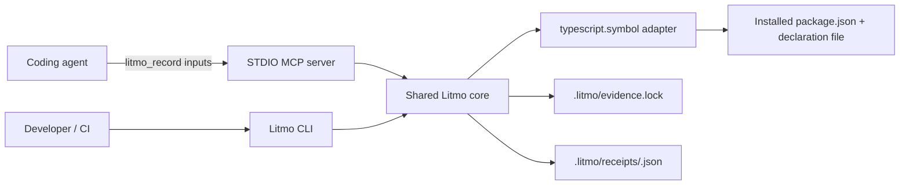

# Architecture

Litmo v0.1 is a local TypeScript application with one deterministic adapter. The CLI and MCP server are thin entry points over the same core.

## Components

- `src/cli.ts`: argument parsing, output, and exit codes for `init`, `record`, `check`, `diff`, and `explain`.
- `src/mcp.ts`: one STDIO tool, `litmo_record`; it accepts locators, not raw receipts.
- `src/core.ts`: record and revalidation policy shared by CLI and MCP.
- `src/adapter/typescript-symbol.ts`: dependency resolution and TypeScript Compiler API inspection.
- `src/storage.ts`: strict untrusted-input validation, canonical writes, content hashes, and lock handling.
- `src/canonical.ts`: deterministic serialization and SHA-256.

## Record path

1. Require an existing target repository and `.litmo/evidence.lock`.
2. Constrain project and affected-code paths to the repository.
3. Resolve a registry-style npm dependency from the consuming `package.json`.
4. Locate the package's `types`/`typings` entry without importing or executing package code.
5. Require the package and declaration file to resolve inside the repository.
6. Use the TypeScript Compiler API to locate one exported callable symbol and its parameter.
7. Normalize the signature, hash it, construct the Receipt payload, and derive the Receipt ID from canonical JSON.
8. Write the Receipt and add its ID to `evidence.lock`.

## Check path and policy

Every check treats both the lock and receipt files as attacker-controlled.

| Axis                | Recomputed signal                                                  | v0.1 policy                                    |
| ------------------- | ------------------------------------------------------------------ | ---------------------------------------------- |
| Evidence integrity  | Strict schema, expected-signature SHA-256, Receipt content SHA-256 | Invalid evidence blocks with exit `2`          |
| Source drift        | Package version and repo-relative resolved declaration path        | Change alone warns and exits `0`               |
| Semantic support    | Exact supported TypeScript call signature                          | Mismatch blocks with exit `1`; no LLM judgment |
| Runtime correctness | None                                                               | Explicitly not evaluated                       |

An unavailable source is not silently called a match. It is reported as `WARNING unverifiable` and remains non-blocking in v0.1 because Litmo has not established a deterministic mismatch.

## Security boundaries

- Receipt paths are derived from IDs matching `sha256:[a-f0-9]{64}`; Receipt input cannot select a filesystem path.
- Lock and Receipt reads reject symlinks and non-regular files, stay inside the repository, and are capped at 1 MiB and 4 MiB respectively.
- Project, affected-code, package, and declaration paths cannot escape the repository.
- Package names must use registry-style npm names; paths and URLs are rejected.
- `package.json` and declaration reads are size-bounded.
- Receipt schemas reject unknown fields, including `matched`, `verified`, or command-shaped additions.
- No adapter invokes a shell, lifecycle script, package entry point, network request, or LLM.
- Atomic temporary-file replacement reduces partial writes. v0.1 does not provide cross-process locking.
- Content hashes detect inconsistent or partially modified evidence; they do not authenticate an author. Someone who can rewrite both a Receipt and the lock can create a new internally valid Receipt, so Git review remains part of the trust model.

## Deliberate limitations

- Exactly one call signature per exported symbol; overload sets are rejected.
- The dependency and its declaration file must resolve inside the repository.
- Only `types` or `typings` package entries are supported.
- Source parse or resolution failure is a non-blocking warning.
- No Receipt signing, transparency service, remote verification, or package-manager-specific store support.
