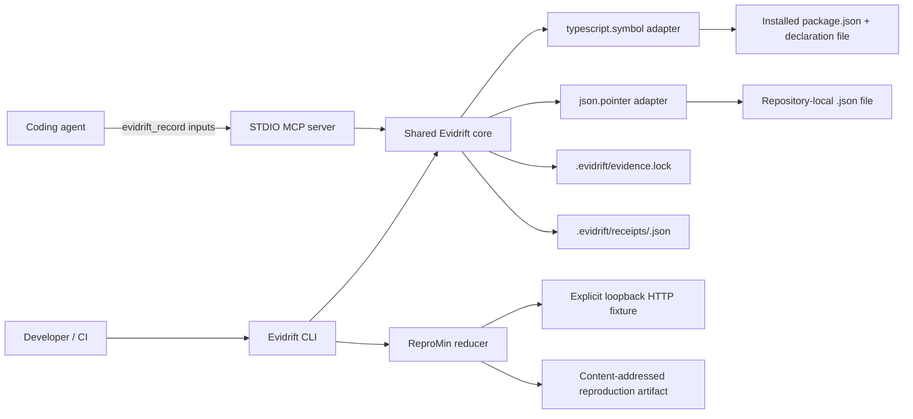

# Architecture

Evidrift is a local TypeScript application with two isolated evidence workflows:

- a closed-world contract core shared by the CLI and STDIO MCP server; and
- a CLI-only ReproMin core that explicitly replays bounded JSON requests to loopback HTTP targets.

```mermaid
flowchart LR
  Agent["Coding agent"] -->|"evidrift_record inputs"| MCP["STDIO MCP server"]
  Human["Developer / CI"] --> CLI["Evidrift CLI"]
  MCP --> Core["Shared Evidrift core"]
  CLI --> Core
  CLI --> Repro["ReproMin reducer"]
  Repro --> Loopback["Explicit loopback HTTP fixture"]
  Repro --> Artifact["Content-addressed reproduction artifact"]
  Core --> TS["typescript.symbol adapter"]
  Core --> JSON["json.pointer adapter"]
  TS --> Installed["Installed package.json + declaration file"]
  JSON --> JsonFile["Repository-local .json file"]
  Core --> Lock[".evidrift/evidence.lock"]
  Core --> Receipts[".evidrift/receipts/<sha256>.json"]
```

## Components

- `src/cli.ts`: argument parsing, output, and exit codes for contract and ReproMin commands.
- `src/mcp.ts`: a bounded newline-delimited JSON-RPC adapter exposing the two recording tools; it accepts locators, not raw receipts or replay requests. Compatibility tests drive it through the official MCP SDK client.
- `src/core.ts`: record and revalidation policy shared by CLI and MCP.
- `src/demo.ts`: a self-contained local fixture that deliberately changes one dependency signature.
- `src/repro.ts`: pure, deterministic JSON reduction with fixed-size SHA-256 candidate-cache keys and a hard probe budget.
- `src/repro-http.ts`: strict fixture/artifact parsing, loopback HTTP probes, failure predicates, and content-addressed artifacts.
- `src/repro-demo.ts`: a zero-configuration disposable loopback demonstration.
- `src/output.ts` and `src/terminal.ts`: TTY-only presentation and stable plain-text fallback output.
- `src/report.ts`: deterministic, versioned JSON check reports for CI and agent integrations.
- `src/adapter/typescript-symbol.ts`: dependency and call-site resolution through the TypeScript Compiler API.
- `src/adapter/json-pointer.ts`: bounded repository JSON loading, RFC 6901 lookup, and hashing.
- `src/storage.ts`: strict untrusted-input validation, canonical writes, content hashes, and lock handling.
- `src/canonical.ts`: deterministic serialization and SHA-256.

## Record path

1. Require an existing target repository and `.evidrift/evidence.lock`.
2. Constrain project and affected-code paths to the repository; affected code must resolve to a regular file.
3. Resolve a registry-style npm dependency from the consuming `package.json`.
4. Locate the package's `types`/`typings` entry without importing or executing package code.
5. Require the package and declaration file to resolve inside the repository.
6. Use the TypeScript Compiler API to locate one exported callable symbol and its parameter.
7. If the symbol is overloaded and affected code includes a line, load the consumer tsconfig and use TypeScript's resolved call signature. Refuse invalid or ambiguous calls.
8. If call-site resolution is unavailable, require an explicit 1-based selector. The index is not persisted.
9. Normalize the selected signature, hash it, construct the Receipt payload, and derive the Receipt ID from canonical JSON.
10. Write the Receipt and add its ID to `evidence.lock`.

The JSON path is shorter: resolve one repository-relative `.json` file, parse one RFC 6901 pointer, canonicalize the selected value and whole document, hash both, then write through the same Receipt storage path. URLs and symlinks are refused.

## Check path and policy

Every check treats both the lock and receipt files as attacker-controlled.

| Axis                | Recomputed signal                                                  | Contract policy                                |
| ------------------- | ------------------------------------------------------------------ | ---------------------------------------------- |
| Evidence integrity  | Strict schema, expected-signature SHA-256, Receipt content SHA-256 | Invalid evidence blocks with exit `2`          |
| Source drift        | Package version and repo-relative resolved declaration path        | Change alone warns and exits `0`               |
| Semantic support    | Exact TypeScript call signature or selected canonical JSON value   | Mismatch blocks with exit `1`; no LLM judgment |
| Runtime correctness | None                                                               | Explicitly not evaluated                       |

For overloaded symbols, revalidation renders at most 64 current call signatures and searches them for the stored signature hash. Reordering or inserting an unrelated overload does not drift the selected contract. Removing or changing the selected signature blocks with the expected signature and current overload set.

For JSON evidence, a whole-document hash change with an unchanged selected value is `WARNING source_changed`; a changed or missing selected value is `FAIL contract_mismatch`. Invalid or unavailable source is not silently called a match. It is `WARNING unverifiable` and remains non-blocking because Evidrift has not established a deterministic mismatch.

## ReproMin path and policy

ReproMin never enters `checkRepository`, Receipt schema v1, `evidence.lock`, or MCP:

1. Parse a strict JSON request fixture from a repository-confined regular file.
2. Require a literal loopback HTTP URL, JSON body, `POST`/`PUT`/`PATCH`, safe headers, and explicit replay confirmation.
3. Require a failure predicate containing both an HTTP status and either a response substring or JSON Pointer equality.
4. Replay the original parsed JSON. Stop without writing an artifact unless the predicate matches.
5. Remove object properties, array chunks, and string characters, and simplify numbers. Re-send every uncached candidate sequentially.
6. Keep a candidate only when the complete predicate still matches.
7. Repeat reducer passes until no selected one-step reduction matches, or stop visibly at the probe budget.
8. Replay the result once more. Write a new content-addressed artifact only after that final match.

The artifact ID covers tool metadata, the minimized request, predicate, and evidence summary.
The artifact contains hashes, byte counts, probe counts, and a bounded minimality claim, but
no response body, timestamp, credential, or claim of root cause. `reproduce` verifies the
artifact ID and minimized-body evidence before one explicit replay.

## Security boundaries

- Receipt paths are derived from IDs matching `sha256:[a-f0-9]{64}`; Receipt input cannot select a filesystem path.
- Lock and Receipt reads reject symlinks and non-regular files, stay inside the repository, and are capped at 1 MiB and 4 MiB respectively.
- A lock can name at most 1,024 Receipts; recording refuses the limit before creating an orphan Receipt file.
- Project, affected-code, package, and declaration paths cannot escape the repository.
- Transitive TypeScript declaration imports are resolved with a repository-confined compiler host and capped at 256 files, 2 MiB per file, and 16 MiB total.
- Package names must use registry-style npm names; paths and URLs are rejected.
- `package.json` and declaration reads are size-bounded.
- Symbols exposing more than 64 call signatures are refused before candidate rendering.
- Receipt schemas reject unknown fields, including `matched`, `verified`, or command-shaped additions.
- No contract adapter invokes a shell, lifecycle script, package entry point, network request, or LLM.
- JSON evidence accepts repository-local regular `.json` files only, capped at 4 MiB; selected canonical values are capped at 1 MiB.
- STDIO MCP input must be valid UTF-8 newline-delimited JSON-RPC, with a 1 MiB message cap and 256 tool calls per process.
- Demo cleanup only replaces a real repository-local directory carrying Evidrift's exact generated marker; symlinks, junctions, and unmarked directories are refused.
- Atomic temporary-file replacement reduces partial writes. The storage design does not provide cross-process locking.
- Untrusted control characters are rejected in stored text and escaped in rendered errors, preventing ANSI control output and forged log lines.
- Content hashes detect inconsistent or partially modified evidence; they do not authenticate an author. Someone who can rewrite both a Receipt and the lock can create a new internally valid Receipt, so Git review remains part of the trust model.

ReproMin adds a separate, explicit network boundary:

- only plain HTTP literal `127.0.0.0/8` and `::1` targets are accepted; hostnames, LAN, public, link-local, metadata, proxy, and remote targets are refused;
- redirects are returned as-is and never followed;
- credentials, cookies, common secret-shaped names, high-confidence token patterns, hop-by-hop headers, and URL credentials are refused; this is defense in depth, not proof that a fixture is sanitized;
- request bodies and fixture files are capped at 1 MiB, inspected responses at 64 KiB, JSON at 10,000 nodes and 64 levels, total probes at 500, fixed-size digest cache keys at one per probe, and each probe at 30 seconds wall-clock time;
- output uses a new repository-confined path and refuses overwrite;
- probe concurrency is one, and candidate connection/timeout failures are unavailable evidence rather than a successful reduction;
- the MCP server and `evidrift check` cannot trigger HTTP replay; and
- confirmation and resource bounds reduce risk but do not make state-changing requests harmless. A disposable local fixture remains required.

## Deliberate limitations

- Call-site overload resolution requires an affected `path:line`, a readable consumer tsconfig when present, and a valid TypeScript call. Otherwise `--overload` is required.
- The selector index is not stored. Revalidation identifies the selected contract by its normalized signature hash.
- The dependency and its declaration file must resolve inside the repository.
- All transitive declaration sources must also resolve inside the repository and stay within the documented resource budgets.
- Only `types` or `typings` package entries are supported.
- Source parse or resolution failure is a non-blocking warning.
- No Receipt signing, transparency service, remote verification, or package-manager-specific store support.
- `json.pointer` does not support YAML, URLs, remote `$ref`, JSON Schema evaluation, or semantic equivalence.
- ReproMin supports parsed JSON bodies only. It does not import cURL, preserve duplicate object keys or numeric token spelling, shrink headers/query/method, replay remote targets, diagnose root cause, or claim a global minimum.
- ReproMin candidate outcomes are cached and assume a deterministic disposable fixture. N-of-M flaky predicates and state-reset hooks are not implemented.
